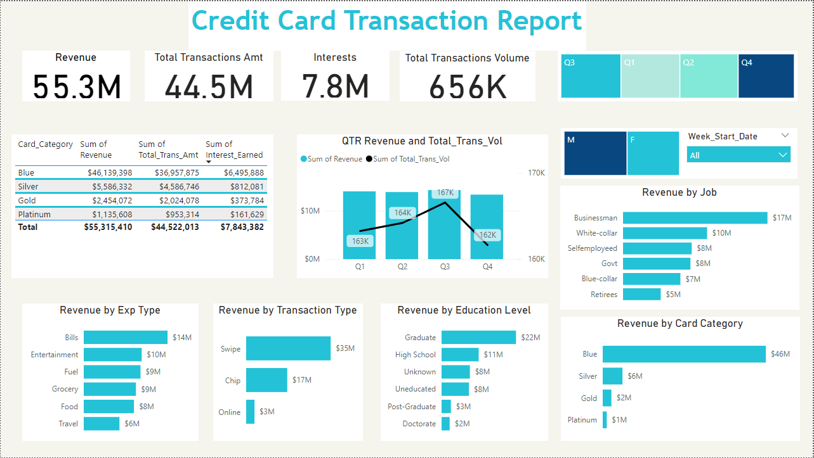
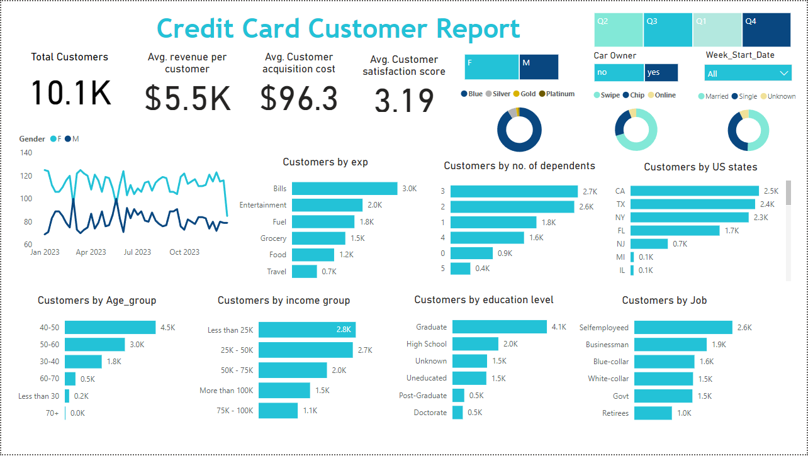

## Credit Card Transaction and Customer Analysis Report

Project Overview

This project presents a comprehensive analysis of credit card transactions and customer data using Power BI. It includes insights into revenue trends, spending patterns, customer demographics, and satisfaction scores. The goal is to enable data-driven decision-making for optimizing credit card offerings and customer strategies.

About Dataset

Sales data description:

Invoice no : Invoice identification number.
Customer id : Customer identification number.
Category : General item categorization groups
Quantity : Number of products
Price : Price of each product.
Invoice date : Date of purchase.
Shopping mall : Shopping mall loaction.

Customer data description:

Customer id : Customer identification number.
Gender : Gender( Male/Female)
Age : Customer age.
Payment method : Payment used by customer

### Dashboard 1: Credit Card Transaction Report

### Key Metrics

#### Revenue:
Represents the total earnings from credit card transactions across various expenditure categories. The total revenue for the period is $55.3M, highlighting the financial impact of customer transactions.

#### Total Transaction Amount:
This is the aggregate sum of all transaction values ($44.5M), reflecting the total spending activity by customers using credit cards.

#### Interests Earned:
Refers to the income generated from interest charges on outstanding balances ($7.8M). This indicates how much revenue comes from customers carrying balances on their credit cards.

#### Transaction Volume:
The total number of individual transactions processed during the period (656K). This helps evaluate the overall activity level of the card user base.

#### Breakdown of Insights

#### Revenue by Expenditure Type:

Customers spent the most on Bills ($14M), followed by Entertainment ($10M), Fuel and Grocery ($9M each).
These categories show where customers prioritize their spending, influencing strategic decisions.

#### Revenue by Education Level:

Graduates lead in spending ($22M), followed by High School ($11M) and Unknown education ($8M).
This highlights the relationship between education and spending power.

#### Revenue by Job:

Businesspeople contribute the highest revenue ($17M), followed by White-collar employees ($10M).
Occupation-based revenue insights help in understanding customer demographics.

#### Revenue by Card Category:

Blue cardholders dominate, accounting for $46M of the total revenue, far exceeding other categories (e.g., Silver: $6M, Gold: $2M).
This data could guide promotional efforts for different card types.

#### Revenue by Transaction Type:

Swipe transactions are the most common ($35M), followed by Chip ($17M) and Online ($3M).
This indicates customer preferences for physical transactions over digital ones.

#### Table of Card Category with Total Revenue( Excl Annual Fees), Total Transactions Amount anbd Total Interests Earned:

Blue cardholders have the highest total revenue with more transactions and Interest earned.

#### Quarterly Revenue and Total Transactions Volume over time:

### Dashboard 2: Credit Card Customer Report

### Key Metrics

#### Total Customers:

Reflects the total number of active credit card users (10.1K), showing the overall size of the customer base.

#### Average Revenue per Customer:

On average, each customer generates $5.5K in revenue. This metric gauges the profitability of individual customers.

#### Average Customer Acquisition Cost:

Indicates the average cost ($96.3) incurred by the company to attract and onboard a new customer, providing insights into marketing efficiency.

#### Customer Satisfaction Score:

The average satisfaction score is 3.19 out of 5, revealing room for improvement in customer experience.

### Breakdown of Insights

#### Customers by Income Group:

Most customers earn less than $50K, with the largest segment earning less than $25K (2.8K).
This suggests a broad appeal of credit card offerings to lower-income groups.

#### Customers by Age Group:

The largest group is aged 40–50 (4.5K customers), followed by 50–60 (3.0K).
The data shows a strong user base among middle-aged customers.

#### Customers by Education Level:

Graduates are the largest segment (4.1K), indicating that higher education correlates with credit card adoption and use.

#### Customers by Job:

Self-employed individuals (2.6K) and Businesspeople (1.9K) make up the largest customer segments.
This points to the popularity of credit cards among entrepreneurial and professional groups.

#### Customers by Expenditure Type:

Bills (3K) and Entertainment (2K) are the top spending categories.
These categories highlight customer priorities in their financial spending.

#### Customers by State:

California (CA: 2.5K), Texas (TX: 2.4K), and New York (NY: 2.3K) lead in customer numbers.
These states represent key regions for business focus.

Technical Details
Tool Used: Power BI

Data Sources: Simulated credit card transaction and customer datasets.

Key Visualizations:
Bar charts, pie charts, and line graphs for revenue and transaction trends.
Demographic distribution graphs for customer insights.

Getting Started

Prerequisites
Install Power BI Desktop.

Files Included

Power BI file for transaction analysis and customer analysis
Credit_card_report.pdf: PDF summary of key metrics and dashboards.

Usage
Open the .pbix files in Power BI Desktop.
Explore interactive visualizations for in-depth insights.
Customize and extend the analysis using Power BI's capabilities.

Insights & Recommendations

Key Findings
Blue cardholders are the largest revenue contributors.
Middle-aged, graduate, and self-employed customers are the most active segments.
Physical swipe transactions dominate over online payments.

Recommendations
Focus marketing campaigns on the 40–50 age group and high-spending states (CA, TX, NY).
Promote online and digital payment options to balance transaction modes.
Enhance customer satisfaction scores through targeted engagement strategies.
Contributing

Contributions are welcome! Please open an issue or submit a pull request for suggestions or updates.

